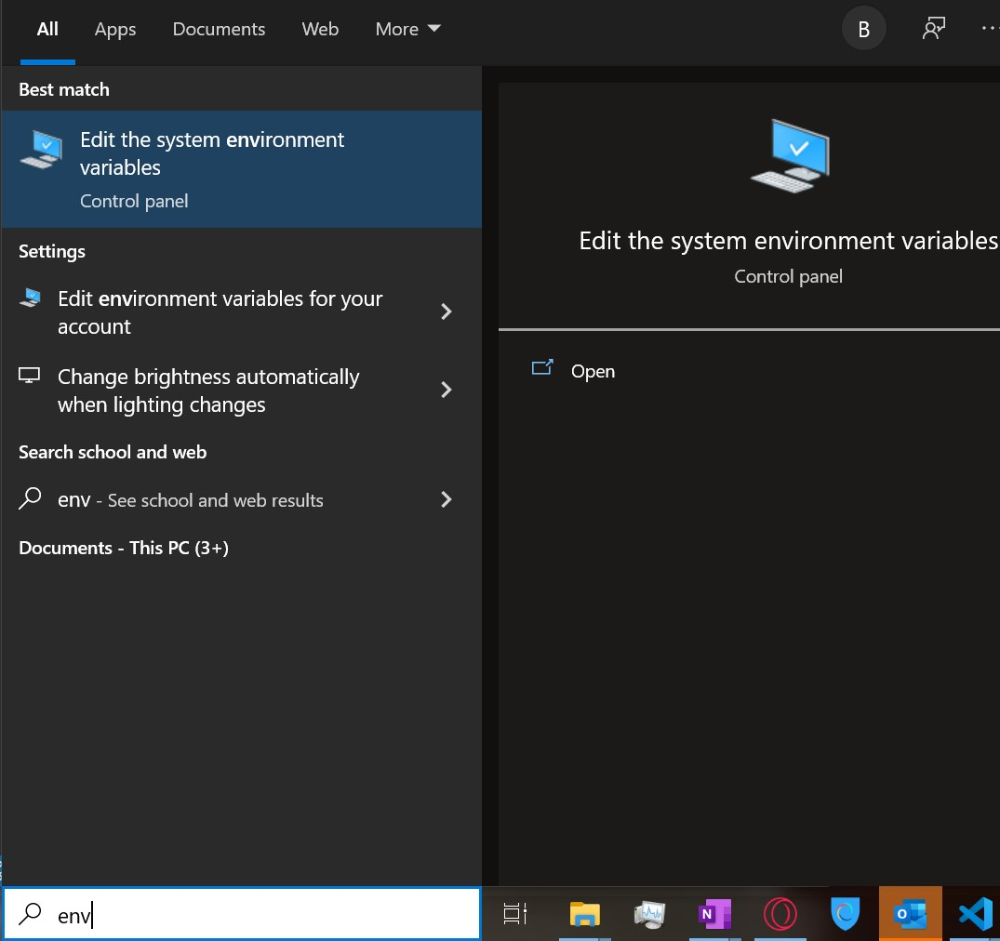

# Adding External Libraries

For some reason, the project doesn't let VSCode easily add external libraries. What seems to work 
is this:
- Add the jar file to the `Steelcase/lib` directory
- Edit the `Steelcase/.classpath` file and add an entry in the `<classpath>` element that follows this syntax:  
    >`<classpathentry exported="true" kind="lib" path="lib/<your_jar_here>.jar"/>`
    - You may also have to add the following line to the .vscode/settings.json file under the referencedLibraries entry in order for VSCode to find the library:
        `"Steelcase/lib/<YOUR_LIBRARY_HERE>.jar"`

# Connecting to the Database

The database is hosted on a Google Cloud SQL instance, and in order to connect to the database you need to authorize the connection using an appropriate Service Account json key. Google's SQL connector libraries are automatically used when the JDBC url looks like  
>`jdbc:mysql:///<DATABASE_NAME>?cloudSqlInstance=<INSTANCE_CONNECTION_NAME>&socketFactory=com.google.cloud.sql.mysql.SocketFactory&user=<MYSQL_USER_NAME>&password=<MYSQL_USER_PASSWORD>`  

The Google library will also automatically use the *GOOGLE_APPLICATION_CREDENTIALS* environment variable to find appropriate credentials to authorize the connection. This [environment variable should be set](#setting-your-environment-variable) to the path of the service account's JSON key file (contact Ethan for it).

## Setting Your Environment Variable

1. In the Windows search bar search for "environment variables" (although it should only take you as much as "env") and hit enter.  
  
2. This opens a System Properties window; click the Environment Variables button near the bottom.  
  
3. Under the User Variables section, click New (It could be a system variable too, it doesn't matter).  
  
4. For the name of the variable, make sure it is GOOGLE_APPLICATION_CREDENTIALS exactly. For the value, you can browse for the file and add it that way or you can copy & paste the absolute path yourself. When done, click OK.  
  
5. Last, restart whatever application you're running java in (the Java VM needs to restart to see our change). After this, DBConnectionTest.java should succeed.

## Testing Your Connection

 To test your connection, make sure [set your environment variable](#setting-your-environment-variable) correctly and run the DBConnectionTest.java class. Without it the test will fail. With the variable set, on failure a stacktrace will print out; contact Ethan with the full printout to troubleshoot your connection.

## Service Account JSON Key

Place the json key in the directory of the repository (the same direcoty the Steelcase project folder is found in, not in the project folder itself). **Under no circumstances should it go to the repo.** Anyone with this key can authorize a connection to our database, and I don't trust github even with private projects. **Don't rename it either**, .gitignore is already set up to ignore the key with its current name.

