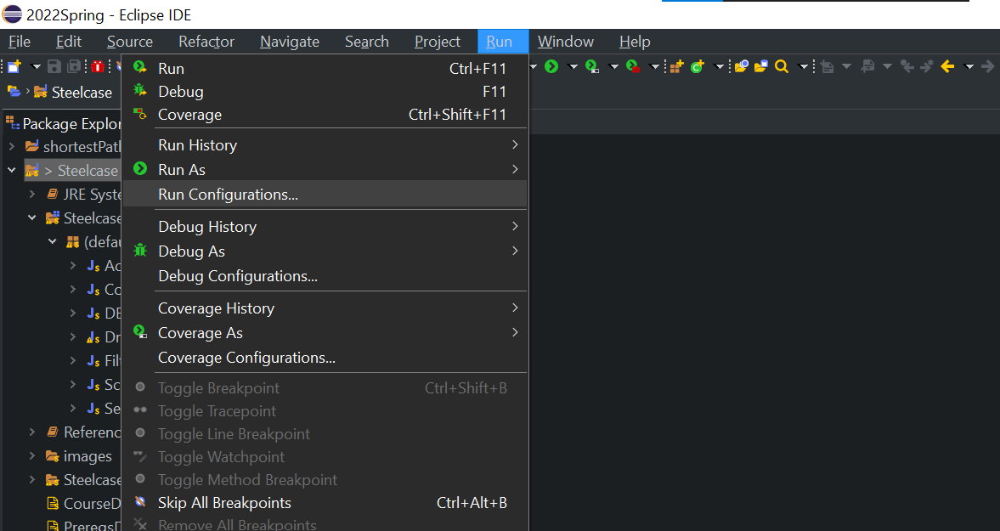

# Adding External Libraries

For some reason, the project doesn't let VSCode easily add external libraries. What seems to work 
is this:
- Add the jar file to the `Steelcase/lib` directory
- Edit the `Steelcase/.classpath` file and add an entry in the `<classpath>` element that follows this syntax:  
    `<classpathentry exported="true" kind="lib" path="lib/<your_jar_here>.jar"/>`
    - You may also have to add the following line to the .vscode/settings.json file under the referencedLibraries entry in order for VSCode to find the library:
        `"Steelcase/lib/<YOUR_LIBRARY_HERE>.jar"`

# Connecting to the Database

The database is hosted on a Google Cloud SQL instance, and in order to connect to the database you need to authorize the connection using an appropriate Service Account json key. Google's SQL connector libraries are automatically used when the JDBC url looks like  
`jdbc:mysql:///<DATABASE_NAME>?cloudSqlInstance=<INSTANCE_CONNECTION_NAME>&socketFactory=com.google.cloud.sql.mysql.SocketFactory&user=<MYSQL_USER_NAME>&password=<MYSQL_USER_PASSWORD>`  

In order to connect you'll need a JSON file called "ambient-scope-342219-3894e6e0fc09.json" ([instructions here](#service-account-json-key). This can be downloaded from the Steelcase Microsoft Teams channel and should be placed in the root directory of the repository (the directory that the Steelcase project folder is found in, not in the project folder itself).

## Setting Your Environment Variable

## Eclipse

On the menu bar, click `Run -> Run Configurations`. In the following dialoge box, in the menu on the left find `Java Application -> DBConnectionTest` and select it. On the right, find the tab labeled "Environment" and select it. Then click "Add" and label the variable **GOOGLE_APPLICATION_CREDENTIALS** and give it the value of **ambient-scope-342219-3894e6e0fc09.json**.  

## VSCode

This should already be done in the launch.json file. No extra work necessary.

## IntelliJ

When creating a runtime configuration, in the Environment Variables field add `GOOGLE_APPLICATION_CREDENTIALS=ambient-scope-342219-3894e6e0fc09.json`.

## Testing Your Connection

To test your connection, make sure you have the json key in the root directory and [set your environment variable](#setting-your-environment-variable) to point to it, then run the DBConnectionTest.java class. Without it the test will fail. With the variable set, on failure a stacktrace will print out; contact Ethan with the full printout to troubleshoot your connection.  
